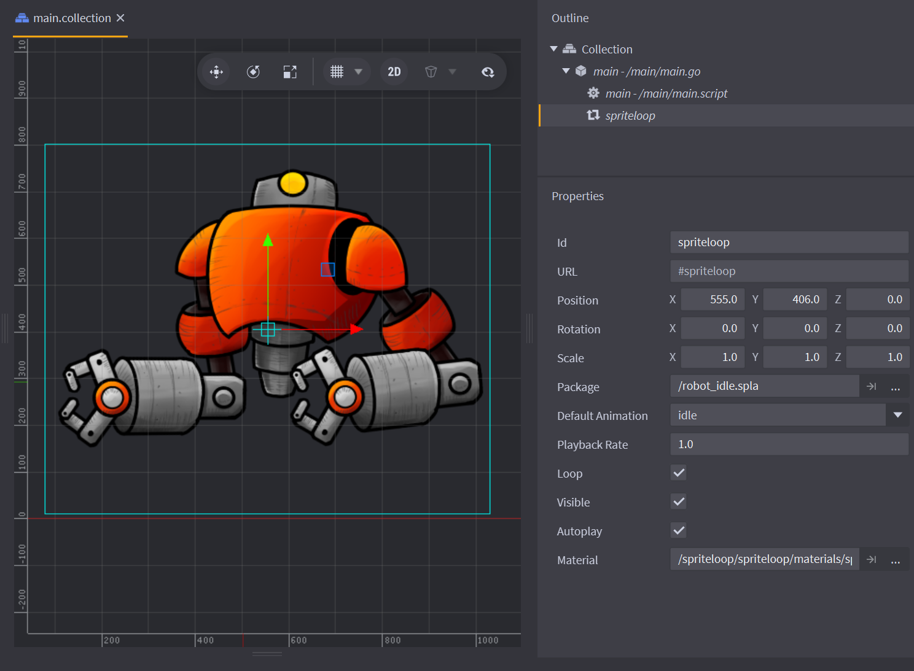

# SpriteLoop for Defold

SpriteLoop for Defold adds native playback for `.spla` animation packages. It
includes a `spriteloop` component, editor integration, Bob builders, Lua helpers,
and a small example project.



## Install

Add a tagged GitHub archive URL to your Defold project dependencies:

```text
https://github.com/Balkan-Ram-Games/spriteloop-defold/archive/refs/tags/v0.4.0-alpha.zip
```

Then fetch libraries from the Defold editor. The archive exposes the extension
folder at `spriteloop/`, which lets Defold discover `spriteloop/ext.manifest`.

After the first install, restart the Defold editor before opening collections or
game objects that already contain embedded SpriteLoop components. Defold can
fetch the extension files without errors, but already-loaded editor resources may
not recognize the newly registered custom component type until the editor starts
again.

## Use

Create a SpriteLoop component and point its package field at a `.spla` file in
your project. Scripts can control the component through:

```lua
local spriteloop = require "spriteloop.spriteloop"

function init(self)
    spriteloop.play_anim("#body", "idle", { loop = true })
end
```

The included example project shows an embedded SpriteLoop component, movement
script, collision object, collection proxy load/unload flow, and cache debug UI.

## Supported Native Extension Libraries

The repository currently includes prebuilt native extension libraries for these
Defold arc-platform folders:

```text
x86_64-win32
x86_64-linux
x86_64-osx
arm64-osx
wasm-web
```

More Defold arc-platforms can be added by committing the matching library under
`spriteloop/lib/<arc-platform>/` and validating the example project for that
target.

Defold/Bob uses `x86_64-macos` as the macOS build platform, but native extension
libraries still live under `x86_64-osx` and `arm64-osx`. This is expected.

Defold's current WebAssembly HTML5 arc-platform is `wasm-web`; the older
asm.js-style `js-web` platform is intentionally not shipped by this extension.

## Validate

Validate the example project with Bob from the repository root. Use the platform
matching the library you want to check:

```sh
python3 utils/validate.py --bob path/to/bob.jar --platform x86_64-win32
```

For macOS validation, use Bob's macOS platform name:

```sh
python3 utils/validate.py --bob path/to/bob.jar --platform x86_64-macos
```

For HTML5/WebAssembly validation, use Defold's WebAssembly platform name:

```sh
python3 utils/validate.py --bob path/to/bob.jar --platform wasm-web
```

On Windows, the same command works from PowerShell:

```powershell
python utils\validate.py --bob path\to\bob.jar --platform x86_64-win32
```

Pass `--java path/to/java` if Java is not on `PATH`. The script checks that the
committed extension files and platform library are present, then runs Bob with
`clean build`. Bob output is hidden on success; pass `--verbose` to print the
full build log.

If `spriteloop/pluginsrc/` or `spriteloop/commonsrc/spriteloop_ddf.proto`
changes, rebuild the editor/Bob plugin jar before validating:

```sh
python3 utils/build_spriteloop_plugin.py --bob path/to/bob.jar --platform x86_64-win32
```

## Layout

```text
game.project              # Example and validation project
spriteloop/               # Defold native extension
  ext.manifest
  spla.lua
  spriteloop.lua
  api/
  commonsrc/
  editor/
  include/
  lib/
  plugins/
  pluginsrc/
  src/
example/                  # Example content
input/                    # Example input bindings
utils/                    # Maintenance scripts
```
