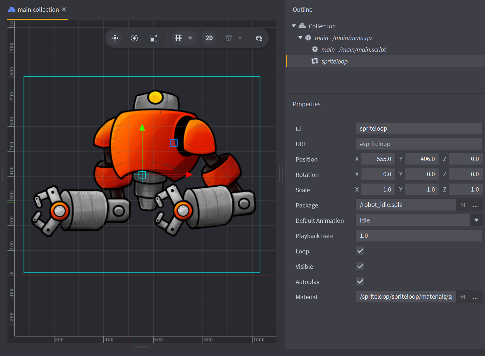

# SpriteLoop for Defold

[](https://github.com/Balkan-Ram-Games/spriteloop-defold/releases/tag/v0.11.0-alpha)

> For SpriteLoop desktop app bugs and feature requests, use the
> [SpriteLoop app issue tracker](https://github.com/Balkan-Ram-Games/spriteloop-app/issues).

SpriteLoop for Defold adds native playback for `.spla` animation packages. It
includes a `spriteloop` component, editor integration, Bob builders, Lua helpers,
and a small example project.



## Install

Add a tagged GitHub archive URL to your Defold project dependencies:

```text
https://github.com/Balkan-Ram-Games/spriteloop-defold/archive/refs/tags/v0.11.0-alpha.zip
```

Then fetch libraries from the Defold editor. The archive exposes the extension
folder at `spriteloop/`, which lets Defold discover `spriteloop/ext.manifest`.

After the first install, restart the Defold editor before opening collections or
game objects that already contain embedded SpriteLoop components. Defold can
fetch the extension files without errors, but already-loaded editor resources may
not recognize the newly registered custom component type until the editor starts
again.

## Use

Create a SpriteLoop component and point its package field at a `.spla` file in
your project. Scripts can control the component through:

```lua
local spriteloop = require "spriteloop.spriteloop"

function init(self)
    spriteloop.play_anim("#robot", "idle", { loop = true })
end
```

The animation argument may be either the exported animation ID or the display
name. Exact IDs are matched before names.

The included example project shows an embedded SpriteLoop component, movement
script, collision object, collection proxy load/unload flow, and cache debug UI.
The example project has separate `consume_events()` and `listen()` event scenes
so each queue-draining approach can be tested in isolation.

## Animation Events

SpriteLoop emits frame events when playback enters a frame. Starting an animation
emits events on frame 0, normal playback emits events for every crossed frame,
and `set_frame()` or `set_time()` emits only events on the destination frame.
You can either
drain the event queue yourself with `consume_events()`, or register Lua
callbacks and drain/dispatch the queue with `dispatch_events()`.

Event emission is enabled by default. Disable it for an entire playback session
with:

```lua
spriteloop.play_anim("#robot", "idle", {
    loop = true,
    emit_events = false,
})
```

For direct positioning, `emit_events` affects only that operation and does not
change whether subsequent playback emits events:

```lua
spriteloop.set_frame("#robot", 10, { emit_events = false })
spriteloop.set_time("#robot", 0.5, { emit_events = false })
```

Direct positioning never emits events from intermediate frames. Explicitly
selecting the current frame emits that frame's events again unless disabled.
Playing or seeking never removes events that were already queued.

Use `consume_events()` when you want explicit control over batching, ordering,
or delayed handling:

```lua
local spriteloop = require "spriteloop.spriteloop"

function update(self, dt)
    for _, event in ipairs(spriteloop.consume_events("#robot")) do
        print(event.name, event.data, event.animation_id, event.animation_name, event.frame, event.source_frame)
    end
end
```

`consume_events()` returns all pending events since the previous consume call
and clears the queue for that component. Pending events remain available until
consumed or displaced by the configured queue limit.

Use `listen()` when you prefer callback-style gameplay code:

```lua
local spriteloop = require "spriteloop.spriteloop"

function init(self)
    self.step_listener = spriteloop.listen("#robot", "step", function(event)
        print("step at frame", event.frame)
    end)
end

function update(self, dt)
    spriteloop.dispatch_events("#robot")
end

function final(self)
    spriteloop.unlisten("#robot", self.step_listener)
end
```

`listen()` is a Lua wrapper over the same native event queue. Call
`dispatch_events(url)` regularly, usually from `update()`, to consume queued
events and invoke matching callbacks. `consume_events(url)` and
`dispatch_events(url)` both drain the same queue, so do not call both for the
same component in the same frame unless you expect the second call to return no
events. Use
`unlisten(url)` to remove every listener for a component, `unlisten(url,
event_name)` to remove every listener for one event name, or `unlisten(url,
listener_id)` to remove one listener returned by `listen()`.

If you use listeners and still want to inspect the consumed events manually, use
the table returned by `dispatch_events()`:

```lua
function update(self, dt)
    local events = spriteloop.dispatch_events("#robot")

    for _, event in ipairs(events) do
        print(event.name, event.frame)
    end
end
```

Each event table contains:

- `event_name` and `name`: the exported event name.
- `data`: the exported event payload string, or an empty string.
- `animation_id`: the exported ID of the animation that emitted the event.
- `animation_name`: the display name of the animation that emitted the event.
- `frame`: the zero-based frame index inside the exported animation.
- `source_frame`: the original editor/source frame number.

The same API is available from `spriteloop.spla` for manually loaded handles:
`spla.consume_events(handle)`.

Each component and low-level handle has an independent bounded event queue. Set
the maximum number of pending events in `game.project`:

```ini
[spriteloop]
max_pending_events = 256
```

The default is 256. Zero and negative values also use 256. When the queue is
full, SpriteLoop drops the oldest event, keeps the newest event, increments
`dropped_event_count`, and logs one warning for that player. `get_info()` exposes
`pending_event_count`, `max_pending_events`, and `dropped_event_count`.

## Skins and Part Variants

A SpriteLoop component can select a default skin in the Defold editor. Runtime
scripts can change the active skin and override individual part variants through
the component-oriented Lua API:

```lua
local spriteloop = require "spriteloop.spriteloop"

function init(self)
    local component = "#robot"

    -- Applies the skin's part variants and visibility settings.
    spriteloop.set_skin(component, "blue_robot")

    -- Overrides one part after applying the skin.
    spriteloop.set_variant(component, "head", "head_helmet")

    spriteloop.play_anim(component, "idle", { loop = true })
end
```

Skin and part APIs accept runtime keys, display names, and the internal IDs
exported in the `.spla` package. Exact IDs are matched first, then keys, then
names:

```lua
local changed = spriteloop.set_skin(url, skin_id_or_name)
local changed = spriteloop.set_variant(url, part_key_or_name, variant_key_or_name)
local changed = spriteloop.clear_variant(url, part_key_or_name)
spriteloop.clear_variants(url)
```

- `set_skin()` returns `true` when the skin ID or name exists.
- `set_variant()` returns `true` when the part resolves and the variant resolves
  to a variant belonging to that part.
- `clear_variant()` returns `true` when the part resolves.
- `clear_variants()` removes every manual part override.

The **Default** option shown for a part in SpriteLoop is not an exported
variant. It means that the part has no manual variant override. Use
`clear_variant()` to select this state for one part, or `clear_variants()` to
restore it for every part. A real variant may still use `default` as its name,
key, or ID.

Failed animation, skin, part, or variant lookups log a Defold warning while
still returning `false`.

Manual part variants take precedence over the active skin. Clearing an override
restores the variant selected by the active skin, or the part's base image when
the skin does not override it. Changing skins does not clear manual part
overrides.

Use `get_info()` to discover the skins and variants available in the loaded
package:

```lua
local info = spriteloop.get_info("#robot")

print("active skin index", info.skin_index) -- zero-based, or -1

for _, skin in ipairs(info.skins) do
    print(skin.id, skin.name, skin.override_count)
end

for _, variant in ipairs(info.variants) do
    print(variant.part_key, variant.key, variant.name, variant.id, variant.rotation, variant.z_offset)
end
```

`info.skins` and `info.variants` are Lua arrays. `skin_index` is the native
zero-based package index and is `-1` when no skin is active.

The same skin and part functions are also available from the low-level
`spriteloop.spla` module for handles returned by `spla.load()`:

```lua
local spla = require "spriteloop.spla"
local handle = spla.load("/character.spla")

spla.set_skin(handle, "blue_robot")
spla.set_variant(handle, "head", "head_helmet")
```

## Runtime Tint

Scripts can tint a whole SpriteLoop character at runtime. Runtime tint is an RGB
multiplier applied on top of the tint authored in the `.spla` package, and
defaults to white:

```lua
local spriteloop = require "spriteloop.spriteloop"

spriteloop.set_tint("#robot", 1, 0.45, 0.45)
spriteloop.clear_tint("#robot")
```

Tint channels are clamped to the 0..1 range. Changing tint frequently on many
components can increase vertex cache misses and vertex buffer uploads because
SpriteLoop applies the multiplier through per-vertex color.

The same API is available from `spriteloop.spla` for manually loaded handles:

```lua
spla.set_tint(handle, 0.5, 0.8, 1)
spla.clear_tint(handle)
```

## Supported Native Extension Libraries

The repository currently includes prebuilt native extension libraries for these
Defold arc-platform folders:

```text
x86_64-win32
x86_64-linux
x86_64-osx
arm64-osx
wasm-web
arm64-android
armv7-android
arm64-ios
x86_64-ios
```

More Defold arc-platforms can be added by committing the matching library under
`spriteloop/lib/<arc-platform>/` and validating the example project for that
target.

Defold/Bob uses `x86_64-macos` as the macOS build platform, but native extension
libraries still live under `x86_64-osx` and `arm64-osx`. This is expected.

Defold's current WebAssembly HTML5 arc-platform is `wasm-web`; the older
asm.js-style `js-web` platform is intentionally not shipped by this extension.

## Validate

Validate the example project with Bob from the repository root. Use the platform
matching the library you want to check:

```sh
python3 utils/validate.py --bob path/to/bob.jar --platform x86_64-win32
```

For macOS validation, use Bob's macOS platform name:

```sh
python3 utils/validate.py --bob path/to/bob.jar --platform x86_64-macos
```

For HTML5/WebAssembly validation, use Defold's WebAssembly platform name:

```sh
python3 utils/validate.py --bob path/to/bob.jar --platform wasm-web
```

For Android validation, use Defold's Android arc-platform names:

```sh
python3 utils/validate.py --bob path/to/bob.jar --platform arm64-android
python3 utils/validate.py --bob path/to/bob.jar --platform armv7-android
```

For iOS validation, use Defold's iOS arc-platform names:

```sh
python3 utils/validate.py --bob path/to/bob.jar --platform arm64-ios
python3 utils/validate.py --bob path/to/bob.jar --platform x86_64-ios
```

On Windows, the same command works from PowerShell:

```powershell
python utils\validate.py --bob path\to\bob.jar --platform x86_64-win32
```

Pass `--java path/to/java` if Java is not on `PATH`. The script checks that the
committed extension files and platform library are present, then runs Bob with
`clean build`. Bob output is hidden on success; pass `--verbose` to print the
full build log.

If `spriteloop/pluginsrc/` or `spriteloop/commonsrc/spriteloop_ddf.proto`
changes, rebuild the editor/Bob plugin jar before validating:

```sh
python3 utils/build_spriteloop_plugin.py --bob path/to/bob.jar --platform x86_64-win32
```

## Layout

```text
game.project              # Example and validation project
spriteloop/               # Defold native extension
  ext.manifest
  spla.lua
  spriteloop.lua
  api/
  commonsrc/
  editor/
  include/
  lib/
  plugins/
  pluginsrc/
  src/
example/                  # Example content
input/                    # Example input bindings
utils/                    # Maintenance scripts
```
